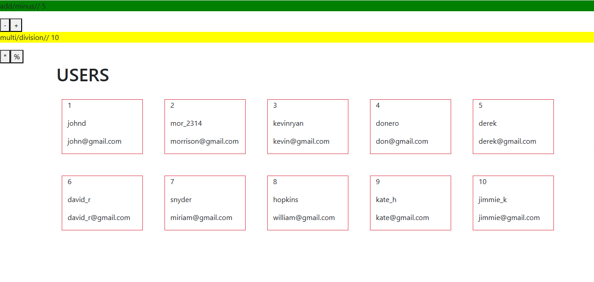

# redux-thunk-useSelector-useDispatch-hooks-iti-ola

This is not a real project ,it just for learning and trying . this simple project built with ReactJs [function-component][hooks] and redux thunk. 

## Table of contents

- [Overview](#overview)
- [Installation](#Installation)
- [Usage](#Usage)
- [Links](#Links)
- [Screenshot](#Screenshot)
- [What I learned](#what-i-learned)
- [Continued development](#continued-development)
- [Author](#author)
- [Acknowledgments](#Acknowledgments)


## overview
This is not a real project ,it just for learning and trying . this simple project built with ReactJs [function-component][hooks] and redux thunk. 

## Installation
To get started with this project, follow these steps:

you can clone the project or download it as Zip file.
1. Clone the repository:
   ```bash
   git clone https://github.com/olahasan/redux-thunk-useSelector-useDispatch-hooks-iti-ola.git

2. Navigate to the project directory:
   cd <project-directory>

3. Install the required dependencies:
   npm install   


## Usage
To run the application, use the following command:

npm start


## Links

If you want to open the link in a new tab, you can:

- Press **Ctrl** (or **Cmd** on Mac) while clicking the link.
- Right-click the link and select **Open link in new tab**.

Otherwise, all links will open in the same tab.


- Solution URL: [here](https://github.com/olahasan/redux-thunk-useSelector-useDispatch-hooks-iti-ola)

- Live Site URL: [here](https://redux-thunk-useselector-usedispatch-hooks-iti-ola.surge.sh/) OR [here](https://redux-thunk-hooks-iti-ola.netlify.app/)

 ## Screenshot
 



## what-i-learned
Through this project:
1. I learned in this project how to create react app and treat with function component,
2. how to deal with redux [Redux thunk - Hooks - useSelector - useDispatch -combineReducers -action creators - REDUX_DEVTOOLS_EXTENSION]
4. how to deal with REDUX_DEVTOOLS_EXTENSION
5. how to deal with useSelector-useDispatch
6. how to deploy it on netlify and serge

## Continued Development
In the future, I plan to:
- learn more about reactJs Hooks.
- learn redux toolkit with reactJs Hooks.

### Author

GitHub - @olahasan

### Acknowledgments

I would like to thank the **[iti](https://iti.gov.eg/home)** for providing this challenge and to the community for their support.

